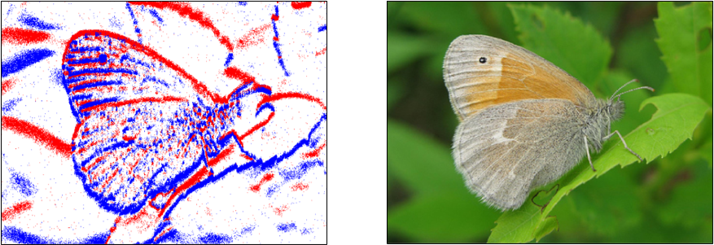
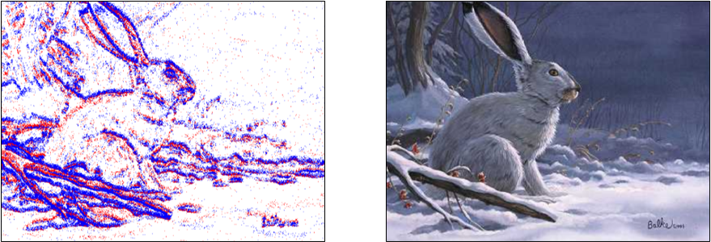

# N-ImageNet: Hacia el Reconocimiento Robusto y de Grano Fino de Objetos con Cámaras de Eventos
Implementación oficial en PyTorch de **N-ImageNet: Towards Robust, Fine-Grained Object Recognition with Event Cameras (ICCV 2021)** [[Paper]](https://openaccess.thecvf.com/content/ICCV2021/html/Kim_N-ImageNet_Towards_Robust_Fine-Grained_Object_Recognition_With_Event_Cameras_ICCV_2021_paper.html) [[Video]](https://www.youtube.com/watch?v=7mWPYGRfk-I).

[](sample_1.png)
[](sample_2.png)


En este repositorio, proporcionamos instrucciones para descargar N-ImageNet junto con la implementación de los modelos base presentados en el artículo. 
Si tiene alguna pregunta sobre el conjunto de datos o las implementaciones base, deje un "issue" o contacte a 82magnolia@snu.ac.kr.

:star2: **Actualización 1** :star2: ¡Ya no es necesario responder cuestionarios para descargar N-ImageNet! Consulte las instrucciones [más abajo](https://github.com/82magnolia/n_imagenet#downloading-n-imagenet) para descargar el conjunto de datos.

:star2: **Actualización 2** :star2: Consulte el benchmark público sobre reconocimiento de objetos y clasificación robusta disponible en el siguiente [enlace](https://paperswithcode.com/dataset/n-imagenet). ¡No dude en subir nuevos resultados al benchmark!

:star2: **Actualización 3** :star2: ¡Hemos lanzado recientemente *mini* N-ImageNet :baby:! El conjunto de datos contiene 100 clases, que es 1/10 del N-ImageNet original. Esperamos que este conjunto de datos permita una evaluación rápida y ligera de nuevos métodos de reconocimiento de objetos basados en eventos. Para descargar el conjunto de datos, consulte las instrucciones indicadas [aquí](https://github.com/82magnolia/n_imagenet#downloading-mini-n-imagenet). Para descargar los modelos preentrenados, consulte [aquí](https://github.com/82magnolia/n_imagenet#downloading-pretrained-models).

:star2: **Actualización 4** :star2: ¡*Finalmente* solucionamos los problemas de descarga de N-ImageNet completo! Ahora N-ImageNet se puede descargar fácilmente desde HuggingFace Datasets :hugs:. Se proporcionan instrucciones detalladas [más abajo](https://github.com/82magnolia/n_imagenet#downloading-n-imagenet). 

## Benchmark de Clasificación de N-ImageNet
Mantenemos un benchmark disponible públicamente para N-ImageNet en el siguiente [enlace](https://paperswithcode.com/dataset/n-imagenet). ¡No dude en subir nuevos resultados al benchmark!

Actualmente tenemos tres benchmarks disponibles.
- **Clasificación en todo N-ImageNet:** Aquí informamos la precisión de clasificación medida en la división de validación original de N-ImageNet.
- **Clasificación en variantes de N-ImageNet:** Aquí informamos la precisión de clasificación promedio medida en las nueve variantes de N-ImageNet. Las variantes de N-ImageNet se registraron con diversas trayectorias de cámara e iluminación, y los detalles se especifican más a fondo [aquí](https://openaccess.thecvf.com/content/ICCV2021/html/Kim_N-ImageNet_Towards_Robust_Fine-Grained_Object_Recognition_With_Event_Cameras_ICCV_2021_paper.html).
- **Clasificación en mini N-ImageNet:** Aquí informamos la precisión de clasificación en la división de validación mini original que contiene 100 clases. Se asume que los modelos fueron entrenados en la división de entrenamiento de mini N-ImageNet, que también contiene el mismo número de clases.

## Descarga de N-ImageNet
N-ImageNet se puede descargar desde Huggingface Datasets: siga el enlace [aquí](https://huggingface.co/datasets/82magnolia/N-ImageNet).
Consulte las siguientes [instrucciones](https://docs.google.com/document/d/1bliFASar5S7t1Ws_wORhUZA4KzF7bZ9fvyNaLt_n9U0/edit?usp=sharing) para saber cómo está organizado el conjunto de datos.
Si tiene alguna pregunta adicional sobre el conjunto de datos, envíe un correo electrónico a 82magnolia@snu.ac.kr.

## Descarga de Mini N-ImageNet
Puede descargar directamente mini N-ImageNet desde [aquí](https://zenodo.org/record/6388221#.Y51iJNJBw5k).
Para obtener acceso a las otras divisiones de validación mini de las variantes de N-ImageNet, consulte el siguiente [enlace](https://huggingface.co/datasets/82magnolia/N-ImageNet/tree/main/mini_validation_variations).

## Instalación y Preparación del Conjunto de Datos
### Instalación
El código ha sido probado en una máquina Ubuntu 18.04 con CUDA 10.1. Sin embargo, es posible que funcione con otras configuraciones.
Primero, cree y active un entorno conda con el siguiente comando.
```
conda env create -f environment.yml
conda activate e2t
```
Además, debe instalar pytorch_scatter. Siga las instrucciones proporcionadas en el [repo de github de pytorch_scatter](https://github.com/rusty1s/pytorch_scatter). Necesita instalar la versión para torch 1.7.1 y CUDA 10.1.

### Configuración del Conjunto de Datos
Antes de pasar al siguiente paso, descargue N-ImageNet junto con `train_list.txt` y `val_list.txt` desde [aquí](https://zenodo.org/record/6388221#.Y51iJNJBw5k). Una vez que descargue N-ImageNet, verá una estructura como la siguiente. **Nota:** Si está utilizando mini N-ImageNet, después de la descarga deberá reestructurar el directorio de la siguiente manera, es decir, mover todos los datos de validación debajo de `extracted_val` y todos los datos de entrenamiento debajo de `extracted_train`.
```
N_Imagenet
├── train_list.txt
├── val_list.txt
├── extracted_train (train split)
│   ├── nXXXXXXXX (label)
│   │   ├── XXXXX.npz (event data)
│   │   │
│   │   ⋮
│   │   │
│   │   └── YYYYY.npz (event data)
└── extracted_val (val split)
    └── nXXXXXXXX (label)
        ├── XXXXX.npz (event data)
        │
        ⋮
        │
        └── YYYYY.npz (event data)
```
El archivo de variantes de N-ImageNet (que se guardaría como `N_Imagenet_cam` al descargarse) tendrá una estructura de archivos similar, excepto que solo contiene archivos de validación.
La siguiente instrucción se basa en N-ImageNet, pero se puede seguir un paso similar para probar con las variantes de N-ImageNet.

Primero, modifique `train_list.txt` y `val_list.txt` para que coincidan con la estructura de directorios de los datos descargados.
Para ilustrar, si abre `train_list.txt` verá lo siguiente:
```
/home/jhkim/Datasets/N_Imagenet/extracted_train/n01440764/n01440764_10026.npz
⋮
/home/jhkim/Datasets/N_Imagenet/extracted_train/n15075141/n15075141_999.npz
```
Modifique cada ruta dentro del archivo .txt para que concuerde con el directorio en el cual se descargó N-ImageNet.
Por ejemplo, si N-ImageNet se encuentra en `/home/user/assets/Datasets/`, modifique `train.txt` de la siguiente manera:
```
/home/user/assets/Datasets/N_Imagenet/extracted_train/n01440764/n01440764_10026.npz
⋮
/home/user/assets/Datasets/N_Imagenet/extracted_train/n15075141/n15075141_999.npz
```
Además, descargue la carpeta `Imagenet/` desde [aquí](https://drive.google.com/drive/folders/14IHTvURvBmNKDtX6E0jQOMl0yTtDvXSy?usp=share_link), la cual contiene los archivos de texto del kit de desarrollo necesarios para ejecutar el código a continuación.

Una vez hecho esto, cree un directorio `Datasets/` dentro de `real_cnn_model`, y cree un enlace simbólico dentro de `Datasets`.
Para ilustrar, utilizando la estructura de directorios del ejemplo anterior, ejecute el siguiente comando.
```
cd PATH_TO_REPOSITORY/real_cnn_model
mkdir Datasets; cd Datasets
ln -sf /home/user/assets/Datasets/Imagenet/ ./
ln -sf /home/user/assets/Datasets/N_Imagenet/ ./
ln -sf /home/user/assets/Datasets/N_Imagenet_cam/ ./  (Si también descargó las variantes)
```
¡Felicidades! Ahora puede comenzar a entrenar/probar modelos en N-ImageNet.

## Entrenamiento de un Modelo
### Conjunto de datos N-ImageNet completo
Puede entrenar un modelo basado en la representación de imagen de eventos binarios con el siguiente comando.
```
export PYTHONPATH=PATH_TO_REPOSITORY:$PYTHONPATH
cd PATH_TO_REPOSITORY/real_cnn_model
python main.py --config configs/imagenet/cnn_adam_acc_two_channel_big_kernel_random_idx.ini
```
Para los ejemplos a continuación, asumimos que la variable de entorno `PYTHONPATH` está configurada como se indicó anteriormente.
Además, puede cambiar detalles menores dentro de la configuración antes del entrenamiento utilizando la bandera `--override`.
Por ejemplo, si desea cambiar el tamaño del lote (batch size), utilice el siguiente comando.
```
python main.py --config configs/imagenet/cnn_adam_acc_two_channel_big_kernel_random_idx.ini --override 'batch_size=8'
```
Además, si desea entrenar un modelo utilizando una representación de eventos diferente, por ejemplo `timestamp image`, utilice el siguiente comando:
```
python main.py --config configs/imagenet/cnn_adam_acc_two_channel_big_kernel_random_idx.ini --override 'loader_type=timestamp_image'
```

### Conjunto de datos mini N-ImageNet
Para entrenar modelos en el conjunto de datos mini N-ImageNet, utilice el siguiente comando. Tenga en cuenta que proporcionamos las contrapartes mini para todas las configuraciones como archivos de config con el prefijo adicional `_mini` adjunto en la carpeta `configs/`.
```
export PYTHONPATH=PATH_TO_REPOSITORY:$PYTHONPATH
cd PATH_TO_REPOSITORY/real_cnn_model
python main.py --config configs/imagenet/cnn_adam_acc_two_channel_big_kernel_random_idx_mini.ini
```
Similar al ejemplo anterior, se puede cambiar la representación de eventos con la bandera `override`. Por ejemplo, para entrenar usando `DiST`, utilice el siguiente comando:
```
python main.py --config configs/imagenet/cnn_adam_acc_two_channel_big_kernel_random_idx_mini.ini --override 'loader_type=dist'
```

## Evaluación de un Modelo
### Conjunto de datos N-ImageNet completo
Suponga que tiene un modelo preentrenado guardado en `PATH_TO_REPOSITORY/real_cnn_model/experiments/best.tar`.
Puede evaluar el rendimiento de este modelo en la división de validación de N-ImageNet utilizando el siguiente comando.
```
python main.py --config configs/imagenet/cnn_adam_acc_two_channel_big_kernel_random_idx.ini --override 'load_model=PATH_TO_REPOSITORY/real_cnn_model/experiments/best.tar'
```
Para una representación nueva (por ejemplo, `timestamp image`), también se debe cambiar el `loader_type` de la siguiente manera:
```
python main.py --config configs/imagenet/cnn_adam_acc_two_channel_big_kernel_random_idx.ini --override 'load_model=PATH_TO_REPOSITORY/real_cnn_model/experiments/best.tar,loader_type=timestamp_image'
```

### Conjunto de datos mini N-ImageNet
Similar al conjunto de datos N-ImageNet completo, suponga que tiene un modelo preentrenado guardado en `PATH_TO_REPOSITORY/real_cnn_model_mini/experiments/best.tar`.
Puede evaluar el rendimiento de este modelo en la división de validación de mini N-ImageNet utilizando el siguiente comando.
```
python main.py --config configs/imagenet/cnn_adam_acc_two_channel_big_kernel_random_idx_mini.ini --override 'load_model=PATH_TO_REPOSITORY/real_cnn_model_mini/experiments/best.tar'
```
Para una representación nueva (por ejemplo, `timestamp image`), también se debe cambiar el `loader_type` de la siguiente manera:
```
python main.py --config configs/imagenet/cnn_adam_acc_two_channel_big_kernel_random_idx_mini.ini --override 'load_model=PATH_TO_REPOSITORY/real_cnn_model_mini/experiments/best.tar,loader_type=timestamp_image'
```

## Convenciones de Nombres
La denominación de las representaciones de eventos utilizadas en el código es diferente a la del artículo original. Utilice la siguiente tabla para convertir las representaciones de eventos utilizadas en el artículo a las utilizadas en el código. Tenga en cuenta que al especificar los nombres de representación en la configuración `.ini`, también puede utilizar los nombres alias que se muestran entre paréntesis.

| Artículo               | Código                                       |
|---------------------|---------------------------------------------|
| DiST                | reshape_then_acc_adj_sort (alias `dist`, `DiST`)  |
| Binary Event Image  | reshape_then_acc_flat_pol (alias `binary_event_image`)  |
| Event Image         | reshape_then_acc (alias `event_image`)           |
| Timestamp Image     | reshape_then_acc_time_pol (alias `timestamp_image`)  |
| Event Histogram     | reshape_then_acc_count_pol (alias `event_histogram`) |
| Sorted Time Surface | reshape_then_acc_sort (alias `sorted_time_surface`)      |

## Descarga de Modelos Preentrenados
Se pueden descargar los modelos preentrenados en el conjunto de datos N-ImageNet a través de los siguientes enlaces. Aquí incluimos los modelos preentrenados y las configuraciones utilizadas para entrenarlos.
- **Conjunto de datos N-ImageNet completo:** [Enlace](https://drive.google.com/drive/folders/1kmtgjX9hC2kRgUjoBklKt53ftkdQOZk-?usp=sharing)
- **Conjunto de datos mini N-ImageNet:** [Enlace](https://drive.google.com/drive/folders/1wVmCOwCoIgxjJkLNy-RO8pxfCQ0bbtyL?usp=share_link)

## Citación
Si encuentra útil el conjunto de datos o el código, por favor cite:

```bibtex
@InProceedings{Kim_2021_ICCV,
    author    = {Kim, Junho and Bae, Jaehyeok and Park, Gangin and Zhang, Dongsu and Kim, Young Min},
    title     = {N-ImageNet: Towards Robust, Fine-Grained Object Recognition With Event Cameras},
    booktitle = {Proceedings of the IEEE/CVF International Conference on Computer Vision (ICCV)},
    month     = {October},
    year      = {2021},
    pages     = {2146-2156}
}
```
