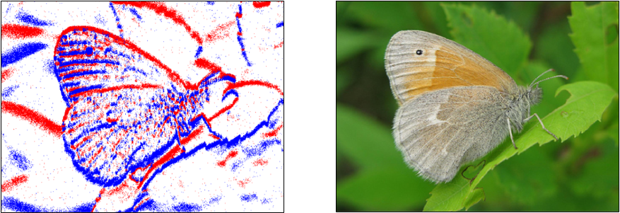
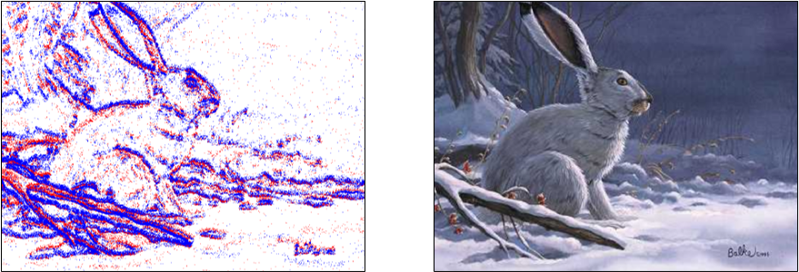

# N-ImageNet: Towards Robust, Fine-Grained Object Recognition with Event Cameras
Official PyTorch implementation of **N-ImageNet: Towards Robust, Fine-Grained Object Recognition with Event Cameras (ICCV 2021)** [[Paper]](https://openaccess.thecvf.com/content/ICCV2021/html/Kim_N-ImageNet_Towards_Robust_Fine-Grained_Object_Recognition_With_Event_Cameras_ICCV_2021_paper.html) [[Video]](https://www.youtube.com/watch?v=7mWPYGRfk-I).

[](sample_1.png)
[](sample_2.png)


In this repository, we provide instructions for downloading N-ImageNet along with the implementation of the baseline models presented in the paper. 
If you have any questions regarding the dataset or the baseline implementations, please leave an issue or contact 82magnolia@snu.ac.kr.

:star2: **Update 1** :star2: Answering questionnaires are no longer necessary to download N-ImageNet! Please refer to the instructions [below](https://github.com/82magnolia/n_imagenet#downloading-n-imagenet) to download the dataset.

:star2: **Update 2** :star2: Check out the public benchmark on object recognition and robust classification available at the following [link](https://paperswithcode.com/dataset/n-imagenet). Feel free to upload new results to the benchmark!

:star2: **Update 3** :star2: We have newly released *mini* N-ImageNet:baby:! The dataset contains 100 classes, which is 1/10 of the original N-ImageNet. We expect the dataset to enable quick and light-weight evaluation of new event-based object recognition methods. To download the dataset, please refer to the instructions stated [here](https://github.com/82magnolia/n_imagenet#downloading-mini-n-imagenet). To download the pretrained models, check [here](https://github.com/82magnolia/n_imagenet#downloading-pretrained-models).

## N-ImageNet Classification Benchmark
We maintain a publicly available benchmark for N-ImageNet at the following [link](https://paperswithcode.com/dataset/n-imagenet). Feel free to upload new results to the benchmark!

Currently we have three benchmarks available.
- **Classification on entire N-ImageNet:** Here we report the classfication accuracy measured on the original validation split from N-ImageNet.
- **Classification on N-ImageNet variants:** Here we report the average classification accuracy measured on the nine N-ImageNet variants. The N-ImageNet variants are recorded on various camera trajectory and lighting, and the details are further specified [here](https://openaccess.thecvf.com/content/ICCV2021/html/Kim_N-ImageNet_Towards_Robust_Fine-Grained_Object_Recognition_With_Event_Cameras_ICCV_2021_paper.html).
- **Classification on mini N-ImageNet:** Here we report the classification accuracy on the mini original validation split which contains 100 classes. The models are assumed to be trained on the mini N-ImageNet train split which also contains the same number of classes.

## Downloading N-ImageNet
To download N-ImageNet, please refer to the following [instructions](https://docs.google.com/document/d/1x0Vqe_5tVAJtYLYSZLwN6oNMExyUjIh-a30oLOKV2rE/edit?usp=share_link).
If you have any additional questions regarding the dataset, drop an email to 82magnolia@snu.ac.kr.

:warning:**Warning**:warning: N-ImageNet is distributed through Google drive. Recently, we found that Google disables large file sharing if the number of total downloads for a short period of time reaches a certain limit. While this is not an issue most of the time, the file sharing links may break on paper deadlines or rebuttal periods. We therefore suggest authors to download N-ImageNet at least four weeks prior to the paper deadline, and earlier the better. Nevertheless, please leave an email to 82magnolia@snu.ac.kr if you are in urgent need of N-ImageNet and the file share links are not working. In previous cases we manages to share N-ImageNet using scp, provided that the requester shares the destination IP.

## Downloading Mini N-ImageNet
You can directly download mini N-ImageNet from [here](https://zenodo.org/record/6388221#.Y51iJNJBw5k).
For gaining access to the other mini validation splits from the N-ImageNet variants, please refer to the following [instructions](https://docs.google.com/document/d/1x0Vqe_5tVAJtYLYSZLwN6oNMExyUjIh-a30oLOKV2rE/edit?usp=share_link).

## Installation and Dataset Preparation
### Installation
The codebase is tested on a Ubuntu 18.04 machine with CUDA 10.1. However, it may work with other configurations as well.
First, create and activate a conda environment with the following command.
```
conda env create -f environment.yml
conda activate e2t
```
In addition, you must install pytorch_scatter. Follow the instructions provided in the [pytorch_scatter github repo](https://github.com/rusty1s/pytorch_scatter). You need to install the version for torch 1.7.1 and CUDA 10.1.

### Dataset Setup
Before you move on to the next step, please download N-ImageNet along with `train_list.txt` and `val_list.txt` from [here](https://zenodo.org/record/6388221#.Y51iJNJBw5k). Once you download N-ImageNet, you will spot a structure as follows. **Note:** If you are using mini N-ImageNet, after downloading you will need to re-structure the directory as below, namely move all the validation data below `extracted_val` and all the training data below `extracted_train`.
```
N_Imagenet
├── train_list.txt
├── val_list.txt
├── extracted_train (train split)
│   ├── nXXXXXXXX (label)
│   │   ├── XXXXX.npz (event data)
│   │   │
│   │   ⋮
│   │   │
│   │   └── YYYYY.npz (event data)
└── extracted_val (val split)
    └── nXXXXXXXX (label)
        ├── XXXXX.npz (event data)
        │
        ⋮
        │
        └── YYYYY.npz (event data)
```
The N-ImageNet variants file (which would be saved as `N_Imagenet_cam` once downloaded) will have a similar file structure, except that it only contains validation files.
The following instruction is based on N-ImageNet, but one can follow a similar step to test with N-ImageNet variants.

First, modify `train_list.txt` and `val_list.txt` such that it matches the directory structure of the downloaded data.
To illustrate, if you open `train_list.txt` you will see the following
```
/home/jhkim/Datasets/N_Imagenet/extracted_train/n01440764/n01440764_10026.npz
⋮
/home/jhkim/Datasets/N_Imagenet/extracted_train/n15075141/n15075141_999.npz
```
Modify each path within the .txt file so that it accords with the directory in which N-ImageNet is downloaded.
For example, if N-ImageNet is located in `/home/user/assets/Datasets/`, modify `train.txt` as follows.
```
/home/user/assets/Datasets/N_Imagenet/extracted_train/n01440764/n01440764_10026.npz
⋮
/home/user/assets/Datasets/N_Imagenet/extracted_train/n15075141/n15075141_999.npz
```
In addition, download the `Imagenet/` folder from [here](https://drive.google.com/drive/folders/14IHTvURvBmNKDtX6E0jQOMl0yTtDvXSy?usp=share_link) which contains the development kit text files needed to run the code below.

Once this is done, create a `Datasets/` directory within `real_cnn_model`, and create a symbolic link within `Datasets`.
To illustrate, using the directory structure of the previous example, deploy the following command.
```
cd PATH_TO_REPOSITORY/real_cnn_model
mkdir Datasets; cd Datasets
ln -sf /home/user/assets/Datasets/Imagenet/ ./
ln -sf /home/user/assets/Datasets/N_Imagenet/ ./
ln -sf /home/user/assets/Datasets/N_Imagenet_cam/ ./  (If you have also downloaded the variants)
```
Congratulations! Now you can start training/testing models on N-ImageNet.

## Training a Model
### Full N-ImageNet dataset
You can train a model based on the binary event image representation with the following command.
```
export PYTHONPATH=PATH_TO_REPOSITORY:$PYTHONPATH
cd PATH_TO_REPOSITORY/real_cnn_model
python main.py --config configs/imagenet/cnn_adam_acc_two_channel_big_kernel_random_idx.ini
```
For the examples below, we assume the `PYTHONPATH` environment variable is set as above.
Also, you can change minor details within the config before training by using the `--override` flag.
For example, if you want to change the batch size use the following command.
```
python main.py --config configs/imagenet/cnn_adam_acc_two_channel_big_kernel_random_idx.ini --override 'batch_size=8'
```
In addition, if you want to train a model using a different event representation, for example `timestamp image`, use the following command:
```
python main.py --config configs/imagenet/cnn_adam_acc_two_channel_big_kernel_random_idx.ini --override 'loader_type=timestamp_image'
```

### Mini N-ImageNet dataset
For training models on the mini N-ImageNet dataset, use the following command. Note that we provide the mini-counterparts for all the configs as configs with additional `_mini` prefixes attached in the `configs/` folder.
```
export PYTHONPATH=PATH_TO_REPOSITORY:$PYTHONPATH
cd PATH_TO_REPOSITORY/real_cnn_model
python main.py --config configs/imagenet/cnn_adam_acc_two_channel_big_kernel_random_idx_mini.ini
```
Similar to the example above, one can change the event representation with the `override` flag. For example, to train using `DiST`, use the following command:
```
python main.py --config configs/imagenet/cnn_adam_acc_two_channel_big_kernel_random_idx_mini.ini --override 'loader_type=dist'
```

## Evaluating a Model
### Full N-ImageNet dataset
Suppose you have a pretrained model saved in `PATH_TO_REPOSITORY/real_cnn_model/experiments/best.tar`.
You can evaluate the performance of this model on the N-ImageNet validation split by using the following command.
```
python main.py --config configs/imagenet/cnn_adam_acc_two_channel_big_kernel_random_idx.ini --override 'load_model=PATH_TO_REPOSITORY/real_cnn_model/experiments/best.tar'
```
For a new representation (e.g. `timestamp image`), one should also change the `loader_type` as follows:
```
python main.py --config configs/imagenet/cnn_adam_acc_two_channel_big_kernel_random_idx.ini --override 'load_model=PATH_TO_REPOSITORY/real_cnn_model/experiments/best.tar,loader_type=timestamp_image'
```

### Mini N-ImageNet dataset
Similar to the full N-ImageNet dataset, suppose you have a pretrained model saved in `PATH_TO_REPOSITORY/real_cnn_model_mini/experiments/best.tar`.
You can evaluate the performance of this model on the mini N-ImageNet validation split by using the following command.
```
python main.py --config configs/imagenet/cnn_adam_acc_two_channel_big_kernel_random_idx_mini.ini --override 'load_model=PATH_TO_REPOSITORY/real_cnn_model_mini/experiments/best.tar'
```
For a new representation (e.g. `timestamp image`), one should also change the `loader_type` as follows:
```
python main.py --config configs/imagenet/cnn_adam_acc_two_channel_big_kernel_random_idx_mini.ini --override 'load_model=PATH_TO_REPOSITORY/real_cnn_model_mini/experiments/best.tar,loader_type=timestamp_image'
```

## Naming Conventions
The naming of event representations used in the codebase is different from that of the original paper. Please use the following table to convert event representations used in the paper to event representations used in the codebase. Note that when specifying the representation names in the config `.ini`, you can also use the alias names shown in parentheses.

| Paper               | Codebase                   |
|---------------------|----------------------------|
| DiST                | reshape_then_acc_adj_sort (alias `dist`, `DiST`)  |
| Binary Event Image  | reshape_then_acc_flat_pol (alias `binary_event_image`)  |
| Event Image         | reshape_then_acc (alias `event_image`)           |
| Timestamp Image     | reshape_then_acc_time_pol (alias `timestamp_image`)  |
| Event Histogram     | reshape_then_acc_count_pol (alias `event_histogram`) |
| Sorted Time Surface | reshape_then_acc_sort (alias `sorted_time_surface`)      |

## Downloading Pretrained Models
One can download the pretrained models on the N-ImageNet dataset through the following links. Here we contain pretrained models and the configs used to train them.
- **Full N-ImageNet dataset:** [Link](https://drive.google.com/drive/folders/1kmtgjX9hC2kRgUjoBklKt53ftkdQOZk-?usp=sharing)
- **Mini N-ImageNet dataset:** [Link](https://drive.google.com/drive/folders/1wVmCOwCoIgxjJkLNy-RO8pxfCQ0bbtyL?usp=share_link)

## Citation
If you find the dataset or codebase useful, please cite

```bibtex
@InProceedings{Kim_2021_ICCV,
    author    = {Kim, Junho and Bae, Jaehyeok and Park, Gangin and Zhang, Dongsu and Kim, Young Min},
    title     = {N-ImageNet: Towards Robust, Fine-Grained Object Recognition With Event Cameras},
    booktitle = {Proceedings of the IEEE/CVF International Conference on Computer Vision (ICCV)},
    month     = {October},
    year      = {2021},
    pages     = {2146-2156}
}
```
